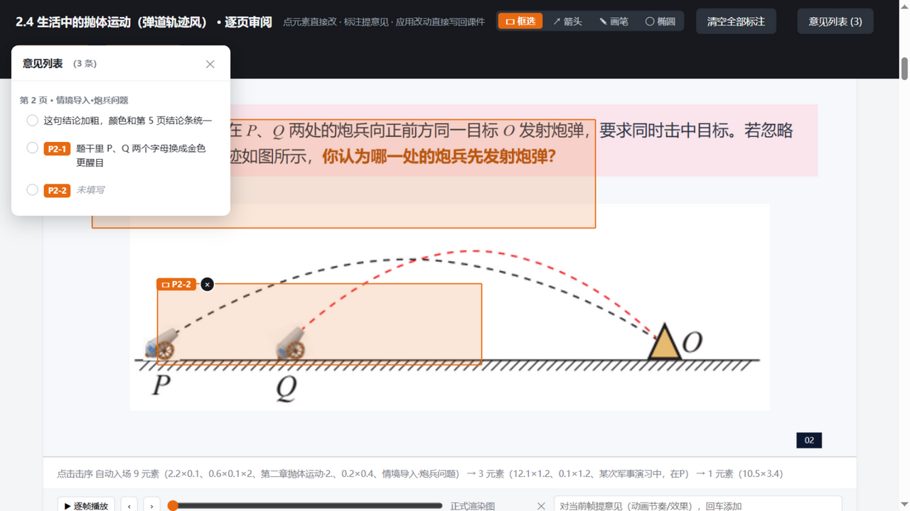
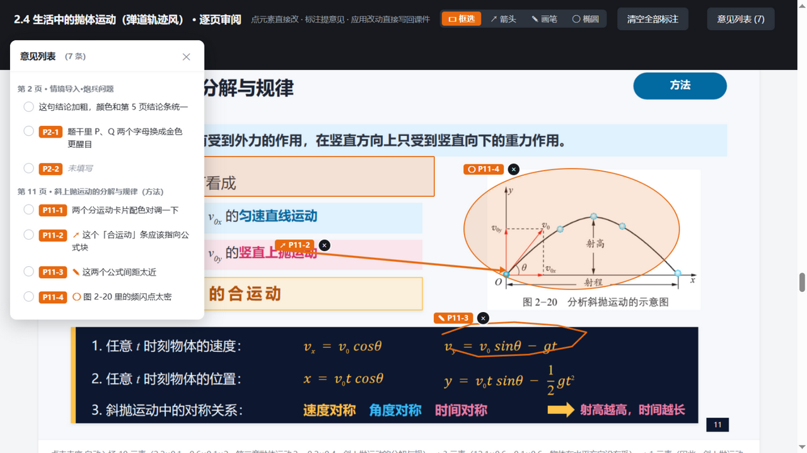
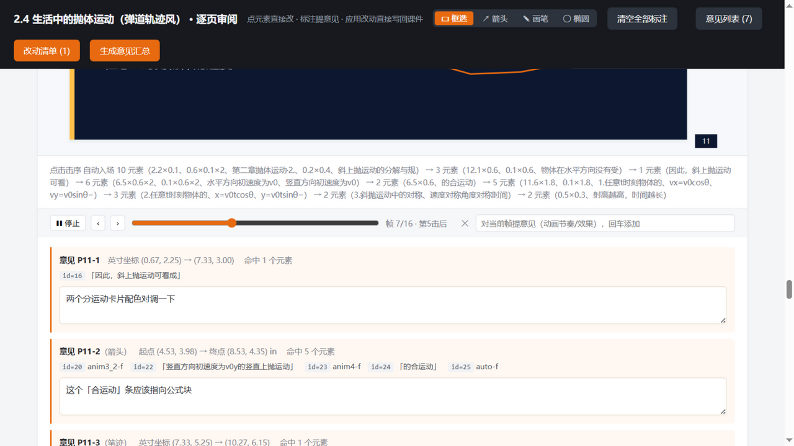
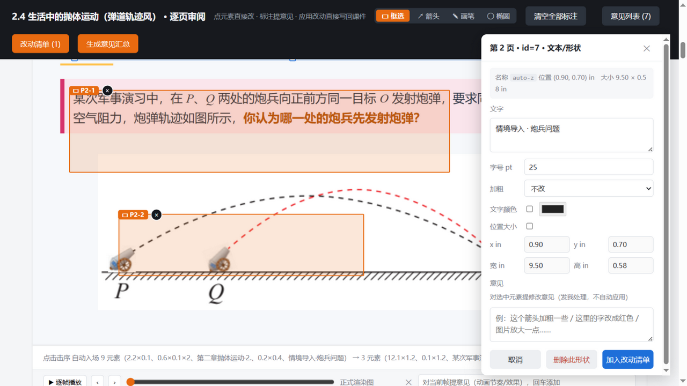
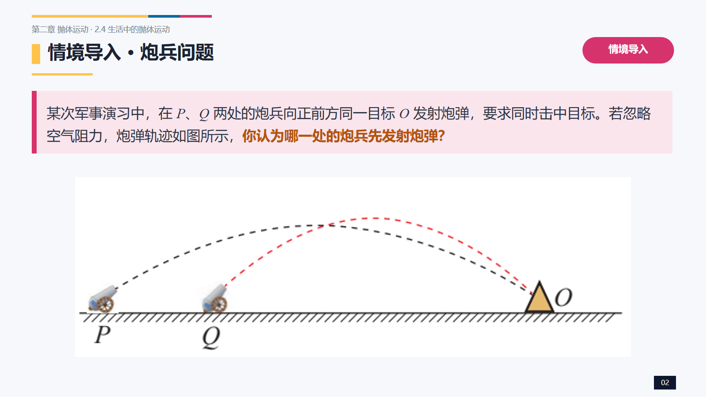
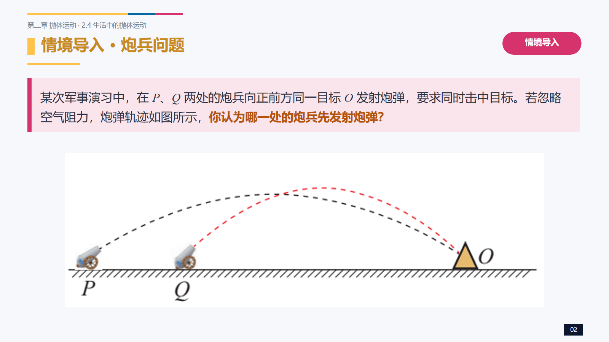

# Slide Review（逐页审阅页）

把 PowerPoint 课件渲染成一个**可交互的本地审阅网页**：在渲染图上点选元素直接改、四种标注形态提意见、逐帧播放看动画——改动直接**写回 .pptx 文件**，带备份、渲染 diff 保护与一键撤销。

典型的「审阅-修改」循环里，反馈者只能对着放映口头描述"第三页那个框往左一点"；本工具把这一步变成可视化操作：小改动自己点两下就闭环，复杂改动用标注发回精确坐标。

## 功能

- **点选直改**：文字、字号、加粗、颜色、位置大小（可拖拽移动/缩放），替换图片（自动压缩、保位置尺寸）、删除形状（自动清理其动画引用）
- **实时预览**：改动先渲染到临时副本，不碰原件；应用后才写回
- **应用写回**：备份 → 写回 → 全册渲染 diff（非改动页必须零差异，否则自动回滚）→ 重建审阅页
- **撤销 + 前后对比**：每次应用可一键撤销；应用前后渲染图并排查看
- **四种标注**：▭ 框选 / ↗ 箭头（意见带「起点→终点」方向语义）/ ✎ 画笔 / ◯ 椭圆，全局编号、侧栏集中管理、双向跳转高亮、可标记已处理
- **逐帧动画审阅**：有动画的页自动生成帧序列，播放器逐帧看击序节奏，对某一帧直接提意见（带帧号）



| 标注形态（框选 / 箭头 / 画笔 / 椭圆） | 逐帧动画审阅 |
|---|---|
|  |  |
| **点选直改 / 替换图片 / 删除形状** |
|  |

**应用前后对比**（左：应用前 · 右：应用后）：

<p>
  
  
</p>

## 工作原理

```
pptx --COM渲染--> 逐页 PNG --本地网页--> 点选/标注/编辑
  ^                                             |
  `---- python-pptx 写回 <-- 改动清单(JSON) ----´
        （备份 + 全册像素 diff 保护 + 可撤销）
```

- **渲染**：PowerPoint COM（兼容 WPS）逐页导出 PNG，保真度与放映一致（含公式、动画终态由帧序列模拟）
- **写回**：python-pptx 直接改 XML（文本/样式/几何/图片 part/删除），不重打包不破坏原结构
- **安全网**：写回前检测文件占用；每次应用留备份链；非改动页逐像素 diff 验证，异常自动回滚

## 环境要求

| 依赖 | 说明 |
|---|---|
| Windows | COM 渲染仅 Windows；macOS/Linux 无法渲染 |
| PowerPoint 或 WPS | 提供 `PowerPoint.Application` COM 组件 |
| PowerShell 7（pwsh） | 渲染脚本宿主 |
| Python 3.9+ | `pip install python-pptx lxml Pillow` |

## 安装（ZCode 插件）

1. ZCode 打开 **插件市场 → 添加 → 添加插件市场**，填入本仓库地址
2. 在个人市场里找到 **Slide Review（逐页审阅页）** → 安装
3. 新任务里直接说「给 xxx.pptx 生成审阅页」即可

## 独立使用（不装 ZCode 插件）

脚本自足，任何 Python 环境可直接跑：

```bash
python scripts/make_review.py 课件.pptx --frames   # 生成审阅页（--frames 为动画页出帧）
python scripts/serve_review.py 8765 课件_review/   # 起服务（必须用它，自带写回 API）
# 浏览器打开 http://127.0.0.1:8765/
```

## 已知局限

- 渲染依赖本机 Office/WPS 的实际渲染效果（字体缺失时以本机替代字体为准）
- 表格/图表/公式对象不支持直接改文字，请用标注提意见
- 单机单用户设计（无实时协作）

## License

[MIT](LICENSE)
